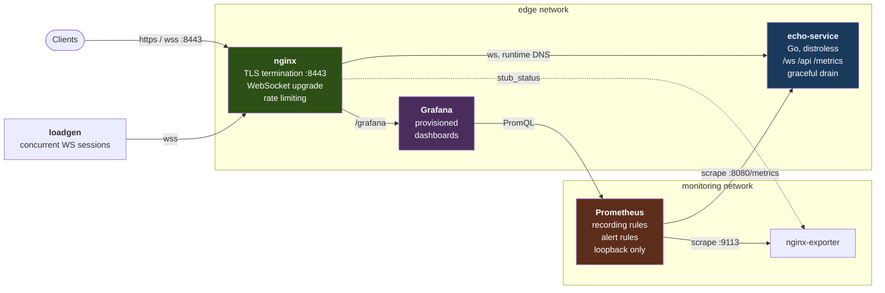

# Realtime Edge Demo

Production infrastructure for a real-time service: a containerized WebSocket
service behind a TLS-terminating reverse proxy, with Prometheus metrics, two
provisioned Grafana dashboards, alert rules, a tag-driven CI/CD pipeline, and
plan-only Terraform for the host it would run on.

The service itself is a stand-in. It is a WebSocket echo service instrumented
the way a media server would be, so the **infrastructure around it** can be
built and exercised end to end without running an SFU. The stand-in is the
small part; everything around it is the point.

Everything runs locally under Docker Compose. Terraform stays plan-only. There
is no cloud spend.

---

## 60-second quickstart

Requires Docker with the Compose plugin. Nothing else - Go, Terraform and
OpenSSL are only needed to develop it, not to run it.

```bash
make demo
```

That generates a self-signed certificate, builds the images, starts the stack,
waits for the edge to answer, and starts a load generator so the dashboards
have real traffic in them.

Then open **https://localhost:8443/grafana/** (`admin` / `admin`) and go to
Dashboards -> Realtime Edge. The browser will warn once about the self-signed
certificate.

Give it about 30 seconds of traffic before reading percentiles.

```bash
make verify   # 15 end-to-end checks against the running stack
make alerts   # what Prometheus is currently firing
make down     # stop
```

---

## Architecture



Two networks, deliberately. Prometheus sits only on `monitoring`, which the
edge cannot route to - so a mistake in the proxy configuration cannot expose an
unauthenticated metrics store. The service's `/metrics` returns 404 at the edge
for the same reason.

---

## What is here

| | |
|---|---|
| **Service** | Go WebSocket echo service. Session capacity ceiling with load shedding, graceful connection draining on SIGTERM, health and readiness split so a draining instance is not restarted. Distroless image, non-root, self-probing health check. |
| **Edge** | Nginx terminating TLS, WebSocket upgrade handling, long-lived connection timeouts, per-IP connection and request limits, security headers, JSON access logs with upstream timings. Upstreams resolved at request time - see below. |
| **Metrics** | Latency histogram bucketed for a real-time path, session gauge, message counters, errors by cause, disconnects by reason. |
| **Dashboards** | Two, provisioned from files: latency (percentiles, distribution heatmap, throughput) and errors/saturation (error ratio, causes, session churn, edge connections). |
| **Alerting** | 6 alert rules over 5 recording rules, each with a runbook link. Symptom-based, not resource-based. |
| **CI** | gofmt, go vet, golangci-lint, race-enabled tests, hadolint, promtool rule validation, nginx config syntax check, terraform fmt/validate, and a full integration job that starts the stack and runs the end-to-end checks. |
| **CD** | Tag-driven. Builds multi-arch, pushes to GHCR with signed build provenance, deploys over SSH pinned by image digest, health-checks, and rolls back automatically on failure. Dry-run by default. |
| **Terraform** | Plan-only DigitalOcean droplet, VPC, reserved IP, block volume and firewall. Variables for region and size. SSH-open-to-the-world is rejected by a validation rule. The WebRTC media port range and TURN are wired behind a flag, off by default. |
| **Operations** | Runbook per alert, backup and restore scripts for the stateful volumes, 15-check end-to-end verification. |

---

## A bug worth reading about

Nginx resolves hostnames in an `upstream` block **once**, at configuration load,
and caches the address forever. Every deploy that replaces the service container
gives it a new address, and Nginx keeps sending traffic to the old one -
returning `no live upstreams` and 502ing every request until somebody reloads it
by hand.

This was found by breaking the running stack rather than by reasoning about it,
and what makes it worth writing down is how it presents: during the failure,
Prometheus was still scraping the service happily and **every application metric
looked completely healthy**. Only the edge knew anything was wrong. On a voice
platform it would be every call dropped, on every release, until a human
noticed.

The fix, the trade-off it costs, and why the resolver address is detected at
container start rather than hardcoded, are in
[`docs/DECISIONS.md`](docs/DECISIONS.md).

---

## Layout

```
echo-service/        service entrypoint
internal/echo/       session handling, config, tests
internal/metrics/    Prometheus instrumentation
loadgen/             concurrent WebSocket load generator
nginx/               edge config template + resolver detection entrypoint
prometheus/          scrape config, recording rules, alert rules
grafana/             provisioned datasource and two dashboards
terraform/           plan-only DO droplet + firewall module
scripts/             certs, wait, verify, deploy, backup, restore
docs/                DECISIONS.md, RUNBOOK.md
.github/workflows/   ci.yml, release.yml
```

## Common commands

```bash
make demo      # the whole thing, with traffic
make verify    # 15 end-to-end checks
make test      # Go tests with the race detector
make lint      # gofmt, go vet
make alerts    # currently firing alerts
make backup    # snapshot the stateful volumes
make tf-validate
make clean     # stop and remove volumes and certificates
```

`make help` lists everything.

## Configuration

Copy `.env.example` to `.env` to override. Every value has a working default,
so the demo runs without one.

Two settings are demo-only and default to on in the compose file:
`PROCESSING_JITTER` adds synthetic latency so the percentile panels show a
distribution, and `ERROR_INJECTION_RATE` produces a ~2% error rate so the error
panels are not a flat zero. Set both to `0` to see the service's real behaviour,
which is sub-millisecond and errorless.

The ports default to 8080/8443 so the stack runs rootless without privileged
port binding. On a real host the edge binds 80/443.

## Documentation

- **[`docs/DECISIONS.md`](docs/DECISIONS.md)** - why Nginx over Caddy/Traefik,
  why the metrics are shaped this way, what is exposed and what is not, and a
  detailed section on **what changes when a real LiveKit/WebRTC deployment
  replaces the stand-in**: media port ranges, why media bypasses the proxy
  entirely, TURN and the silent-failure mode it prevents, and which parts of
  this stack carry over unchanged.
- **[`docs/RUNBOOK.md`](docs/RUNBOOK.md)** - a procedure per alert, written for
  someone who did not build this and was woken up by it.

## Scope

This is a demonstration of an infrastructure pattern, not a product.

- The echo service stands in for a media server. It is not one.
- The TLS certificate is self-signed. Production uses ACME.
- Terraform is plan-only and has no state backend, by design.
- The deploy pipeline defaults to a dry run and has no host to deploy to.
- `admin`/`admin` is a demo credential in a stack bound to localhost.

Each of those is a deliberate choice with its reasoning recorded in
`docs/DECISIONS.md`.
